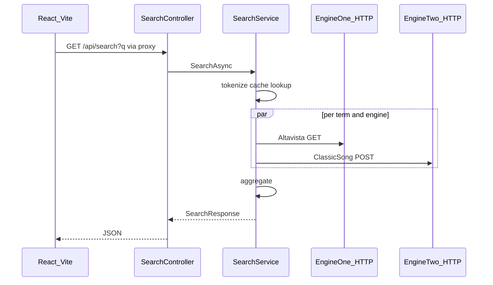

# Search Count

Aggregates search hit counts from two external providers via an ASP.NET Core API and a React UI.

## Prerequisites

- [.NET SDK 10](https://dotnet.microsoft.com/download) (`net10.0` in [`apps/api/api.csproj`](apps/api/api.csproj))
- [Node.js](https://nodejs.org/) (LTS recommended) with npm

## Installation

From the repository root:

```bash
npm install
npm --prefix apps/web install
dotnet restore apps/api/api.csproj
```

- **Root** — installs `concurrently` (used by `npm run dev`)
- **Frontend** — `apps/web` dependencies
- **API** — NuGet packages for `apps/api`

## How to run locally

### Quick start (recommended)

From the repository root:

```bash
npm run dev
```

This uses [concurrently](https://www.npmjs.com/package/concurrently) to run both processes in one terminal with prefixed, color-labeled output (`API`, `WEB`):

| Process | Command | URL |
| ------- | ------- | --- |
| API | `dotnet watch` on `apps/api` | `http://localhost:5135` |
| Web | Vite dev server | `http://localhost:5173` (typical) |

Open the URL Vite prints. The UI calls `/api/search` on the dev server.

**Before searching:** configure API tokens in [Environment / secrets setup](#environment--secrets-setup) — without them, engine calls will fail.

**Vite proxy:** requests to `/api/*` on the Vite port are forwarded to `http://localhost:5135`, so the browser uses same-origin `/api/search` during development (see [`apps/web/vite.config.ts`](apps/web/vite.config.ts)).

### Manual mode (two terminals)

**Terminal 1 — API:**

```bash
cd apps/api
dotnet run
```

**Terminal 2 — Web** (from repo root):

```bash
npm run dev:web
```

Or from `apps/web`:

```bash
npm run dev
```

## Environment / secrets setup

The API calls external search engines with an `x-api-token` header. Tokens are **not** checked into source control; configure them with [.NET User Secrets](https://learn.microsoft.com/en-us/aspnet/core/security/app-secrets) in the API project.

From the repository root:

```bash
cd apps/api

dotnet user-secrets set "SearchProviders:EngineOne:Token" "<engine-one-token>"
dotnet user-secrets set "SearchProviders:EngineTwo:Token" "<engine-two-token>"
```

Use the API tokens supplied for the Voyado test task. Both engines share the same base URL in [`appsettings.json`](apps/api/appsettings.json), but each has its own secret key — set `EngineOne` and `EngineTwo` tokens independently (they may differ).

Verify secrets are stored (values are hidden in the list output):

```bash
dotnet user-secrets list
```

Base URLs for the engines live in [`apps/api/appsettings.json`](apps/api/appsettings.json) under `SearchProviders`; only the tokens belong in user secrets.

---

## Tech stack

**API**

- ASP.NET Core 10
- Serilog (console)
- `IMemoryCache`
- `Microsoft.Extensions.Http.Resilience` (HTTP client retries)

**Web**

- React 19, Vite 8, TypeScript
- Tailwind CSS 4, Biome

**Tooling**

- `concurrently` at repo root (`npm run dev`)

## Architecture overview



**API layout** (`apps/api`):

- `Controllers` — HTTP endpoints
- `Services` / `Application` — `SearchService`, tokenization, aggregation
- `Infrastructure` — HTTP clients for each engine
- `Core` — `ISearchEngineClient`, models

**External engines** (configured in `appsettings.json`):

- **Engine one** — `GET /api/AltavistaSearchEngine?query={term}`
- **Engine two** — `POST /api/ClassicSongSearchEngine` with `{ "query": "{term}" }`

## Key features

- **Tokenization** — query split on whitespace; each term queried against both engines in parallel
- **Aggregation** — counts summed per provider (`engineOne`, `engineTwo`); `totalHits` is the sum across providers
- **Caching** — `IMemoryCache`, 5-minute TTL; key `search:{terms sorted and joined by |}`; cache hit/miss logged
- **Logging** — Serilog to console with timestamp/level template and `Application` property ([`Program.cs`](apps/api/Program.cs))
- **Resilience**
  - HTTP clients: standard resilience handler — 3 retries, 2s delay between attempts
  - Per engine/term failure: logged, count treated as `0`; HTTP 200 still returned with partial results
- **UI** — search input, loading skeleton, total hits or error message

## API documentation

### Health

```bash
curl http://localhost:5135/health
```

Response: `{ "status": "ok" }`

### Search

```bash
curl "http://localhost:5135/api/search?q=hello%20world"
```

Via Vite proxy (with dev servers running):

```bash
curl "http://localhost:5173/api/search?q=hello%20world"
```

| Item | Detail |
| ---- | ------ |
| Method | `GET` |
| Path | `/api/search` |
| Query | `q` (required; whitespace-only → `400`) |

**Example response:**

```json
{
  "query": "hello world",
  "results": [
    { "provider": "engineOne", "count": 42 },
    { "provider": "engineTwo", "count": 17 }
  ],
  "totalHits": 59
}
```

REST examples for IDE clients: [`apps/api/api.http`](apps/api/api.http).

**400** when `q` is missing or whitespace:

```json
{ "error": "Query parameter 'q' is required." }
```

## Testing

From the repository root:

```bash
dotnet test tests/SearchCount.Api.Tests/SearchCount.Api.Tests.csproj
```

**Coverage:**

- `QueryTokenizer` — whitespace splitting
- `SearchResultAggregator` — per-provider sums and total
- `SearchService` — mocked engines, tokenization and aggregation flow

Uses xUnit, Moq, and FluentAssertions.
